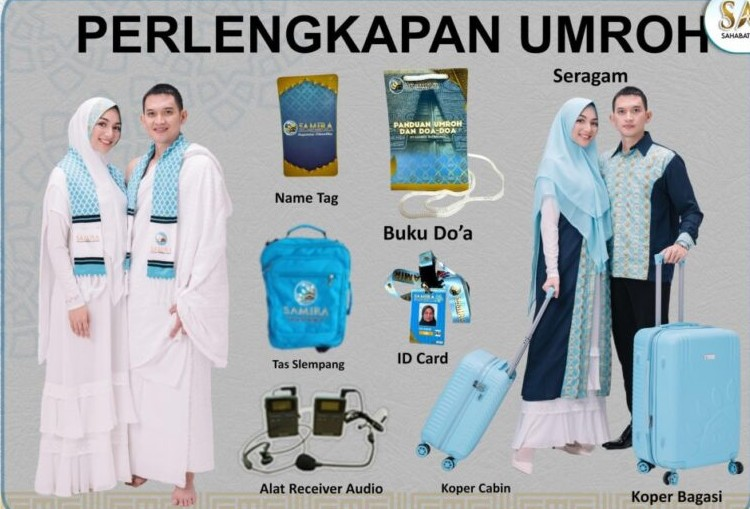

<!doctype html>
<html lang="en">
    <head>
        <meta charset="utf-8">
        <meta name="viewport" content="width=device-width, initial-scale=1">

        <meta name="description" content="">
        <meta name="author" content="">

        <title>Gentlemen's BerkahUmroh - HTML CSS Template</title>

        <!-- CSS FILES -->        
        <link rel="preconnect" href="https://fonts.googleapis.com">
        
        <link rel="preconnect" href="https://fonts.gstatic.com" crossorigin>

        <link href="https://fonts.googleapis.com/css2?family=Unbounded:wght@300;500&display=swap" rel="stylesheet">

        <link href="css/bootstrap.min.css" rel="stylesheet">

        <link href="css/bootstrap-icons.css" rel="stylesheet">

        <link href="css/templatemo-barber-shop.css" rel="stylesheet">
<!--

TemplateMo 585 Berkah_Umroh

https://templatemo.com/tm-585-Berkah_Umroh

-->
    </head>
    
    <body>

        

            

                <button class="navbar-toggler d-md-none collapsed" type="button" data-bs-toggle="collapse" data-bs-target="#sidebarMenu" aria-controls="sidebarMenu" aria-expanded="false" aria-label="Toggle navigation">
                    
                </button>

                <nav id="sidebarMenu" class="col-md-4 col-lg-3 d-md-block sidebar collapse p-0">

                    

                        

                        <ul class="nav flex-column">
                            <li class="nav-item">
                                <a class="nav-link click-scroll" href="#section_1">Beranda</a>
                            </li>

                            <li class="nav-item">
                                <a class="nav-link click-scroll" href="#section_2">Cerita Kami</a>
                            </li>

                            <li class="nav-item">
                                <a class="nav-link click-scroll" href="#section_3">Layanan</a>
                            </li>

                            <li class="nav-item">
                                <a class="nav-link click-scroll" href="#section_4">Daftar Harga</a>
                            </li>

                            <li class="nav-item">
                                <a class="nav-link click-scroll" href="#section_5">Kontak</a>
                            </li>
                        </ul>
                    

                </nav>
                
                

                    <section class="hero-section d-flex justify-content-center align-items-center" id="section_1">

                            

                                

                                    

                                        <h1 class="text-white mb-lg-3 mb-4"><strong>Berkah <em>Umroh</em></strong></h1>
                                        
Kami siap melayani perjalanan ibadah anda dengan amanah dan nyaman

                                         
                                        <a class="btn custom-btn custom-border-btn custom-btn-bg-white smoothscroll me-2 mb-2" href="#section_2">Layanan Kami</a>

                                        <a class="btn custom-btn smoothscroll mb-2" href="#section_3">Kenapa memilih kami?</a>
                                    

                                

                            

                            

                                

                                <h4><strong class="text-white">Perjalanan Suci Menuju Baitullah</strong></h4>

                                <a href="#booking-section" class="smoothscroll btn custom-btn custom-btn-italic mt-3">Daftar Sekarang</a>
                            

                    </section>

                    <section class="about-section section-padding" id="section_2">
                        

                            

                                

                                    <h2 class="mb-4">Layanan perjalanan umroh</h2>

                                    

                                        
Berkah Umroh menghadirkan berbagai layanan terbaik untuk mendampingi ibadahh suci anda, mulai dari manasik hingga akomodasi berkualitas, semua dirancang agar perjalanan menuju Baitullah berjalan dengan lancar dan penuh dengan keberkahan

                                    

                                

                                    <h6 class="mb-5">Admin</h6>

 

    

    

        
Nailah

        <ul class="social-icon ms-auto d-flex">
            <li class="social-icon-item">
                
            </li>
            <li class="social-icon-item">
                
            </li>
        </ul>
    

    

    

        
Tazkia

        <ul class="social-icon ms-auto d-flex">
            <li class="social-icon-item">
                
            </li>
            <li class="social-icon-item">
                
            </li>
        </ul>
    

    

    

        
Rahmat

        <ul class="social-icon ms-auto d-flex">
            <li class="social-icon-item">
                
            </li>
            <li class="social-icon-item">
                
            </li>
        </ul>
    

    

    

        
Rio

        <ul class="social-icon ms-auto d-flex">
            <li class="social-icon-item">
                
            </li>
            <li class="social-icon-item">
                
            </li>
        </ul>
    

                                        

                            

                        

                    </section>

                    <section class="featured-section section-padding">
                        

                        

                            

                                

                                    <h2 class="mb-3 text-white">BERKAH UMROH</h2>

                                    <h4>menemani perjalanan umrohmu</h4>
                                    
chat kami menggunakan kode promo

                                    <strong>Kode Promo: Traveldisini</strong>
                                

                            

                        

                    </section>

                    <section class="services-section section-padding" id="section_3">
                        

                            

                                

                                    <h2 class="mb-5">Services</h2>
                                

                                

                                    

                                        

                                        

                                            <h4 class="mb-0">Transportasi</h4>

                                        

                                    

                                

                                

                                    

                                        

                                        

                                            <h4 class="mb-0">Konsumsi</h4>

                                        

                                    

                                

                                

                                    

                                        

                                        

                                            <h4 class="mb-0">Penginapan</h4>

                                        

                                    

                                

                                

                                    

                                        

                                        

                                            <h4 class="mb-0">Perlengkapan</h4>

                                        

                                    

                                

                            

                        

                    </section>

                    <section class="booking-section section-padding" id="booking-section">
                    

                        

                            

                                <form action="#" method="post" class="custom-form booking-form" id="bb-booking-form" role="form">
                                    

                                        <h2 class="mb-1">Daftar Sekarang</h2>

                                        
Silahkan isi formulir dan kami akan menghubungi anda kembali

                                    

                                    

                                        

                                            

                                                <input type="text" name="bb-name" id="bb-name" class="form-control" placeholder="Nama Lengkap" required>
                                            

                                            

                                                <input type="tel" class="form-control" name="bb-phone" placeholder="Nomor Telepon" pattern="[0-9]{3}-[0-9]{3}-[0-9]{4}" required="">
                                            

                                        
                                            

                                                <input type="text" name="bb-name" id="bb-name" class="form-control" placeholder="Email" required>
                                            

                                            

                                                <select class="form-select form-control" name="bb-branch" id="bb-branch" aria-label="Default select example">
                                                    <option selected="">Pilihan Paket Umroh</option>
                                                    <option value="Reguler">Reguler</option>
                                                    <option value="VIP">VIP</option>
                                                    <option value="Umroh Plus">Umroh Plus</option>
                                                </select>

                                            

                                            

                                                <input type="date" name="bb-date" id="bb-date" class="form-control" placeholder="Date" required>
                                            

                                            

                                                <select class="form-select form-control" name="bb-branch" id="bb-branch" aria-label="Default select example">
                                                    <option selected="">Jenis Kelamin</option>
                                                    <option value="Perempuan">Perempuan</option>
                                                    <option value="Laki-Laki">Laki-Laki</option>
                                                </select>
                                        

                                        <textarea name="bb-message" rows="3" class="form-control" id="bb-message" placeholder="Comment (Optionals)"></textarea>

                                        

                                            <button type="submit" class="form-control">Kirim</button>
                                        

                                    

                                </form>
                        

                    

                </section>

                    <section class="price-list-section section-padding" id="section_4">
                        

                            

                                

                                    

                                        

                                            <h2 class="mb-2">Daftar Harga</h2>

                                            <strong>Mulai dari Rp.30.000.000</Rp></strong>
                                        

                                        

                                            <h6 class="d-flex">
                                                Reguler
                                                

                                                <strong>Rp.30.000.000</strong>
                                            </h6>
                                        

                                        

                                            <h6 class="d-flex">
                                                VIP
                                                

                                                <strong>Rp.35.000.000</strong>
                                            </h6>
                                        

                                        

                                            <h6 class="d-flex">
                                                Umroh Plus
                                                

                                                <strong>Rp.40.000.000</strong>
                                            </h6>
                                        

                                        

                                    

                                

                                    
                                

                            

                        

                    </section>

                <section class="contact-section" id="section_5">
                    

                        

                            
   

                                

                                    <h2 class="text-center">Ayo daftar sekarang!</h2>
                                

                            

                        

                    

                    

                        

                            

    <h5 class="mb-3"><strong>Informasi</strong> Kontak</h5>

    

        <a href="tel:+6282149425430" class="site-footer-link">
            (+62) 821-4942-5430
        </a>
    

    

        <a href="mailto:berkahumroh@gmail.com" class="site-footer-link">
            berkahumroh@gmail.com
        </a>
    

    <!-- Social Icons -->
    <ul class="social-icon d-flex">
        <li class="social-icon-item">
            
        </li>
        <li class="social-icon-item">
            
        </li>
    </ul>

                                

                                    

                                        <h6 class="mb-0">
                                            <i class="custom-icon bi-shop me-3"></i>

                                            <strong>Jam Buka</strong>

                                            <strong class="ms-auto">10:00 AM - 8:00 PM</strong>
                                        </h6>
                                    

                                

                                

                                    <iframe class="google-map" src="https://www.google.com/maps/embed?pb=!1m18!1m12!1m3!1d3982.1390738794634!2d98.67451587496472!3d3.5915785504305745!2m3!1f0!2f0!3f0!3m2!1i1024!2i768!4f13.1!3m3!1m2!1s0x303131c1d2167897%3A0x930a76055d2aaee9!2sUniversitas%20Muhammadiyah%20Sumatera%20Utara!5e0!3m2!1sid!2sid!4v1719724012345!5m2!1sid!2sid" width="100%" height="300" style="border:0;" allowfullscreen="" loading="lazy" referrerpolicy="no-referrer-when-downgrade"></iframe>
                                

                            

                        

                    

                </section>

                <footer class="site-footer">
                    

                        

                            

                                <h4 class="site-footer-title mb-4">Our Branches</h4>
                            

                            

                                

                                    <strong class="mb-1">AM.Djalaluddin</strong>

                                    
Medan,Sumatera Utara

                                

                            

                            

                                

                                    <strong class="mb-1">Menteng</strong>

                                    
Medan,Sumatera Utara

                                

                            

                            

                                <strong class="mb-1">trunojoyo</strong>

                                
Medan,Sumatera Utara

                            

                        

                    

                    

                        

                            

                                

                                    
Copyright © 2036 Berkah Umroh
                                    - Design: <a href="https://templatemo.com" rel="nofollow" target="_blank">TemplateMo</a>

                                

                                

                                    <a href="#section_1" class="back-top-icon smoothscroll" title="Back Top">
                                        <i class="bi-arrow-up-circle"></i>
                                    </a>
                                

                            

                        

                    

                </footer>
            

        <!-- JAVASCRIPT FILES -->
        
        
        
        

    </body>
</html>
